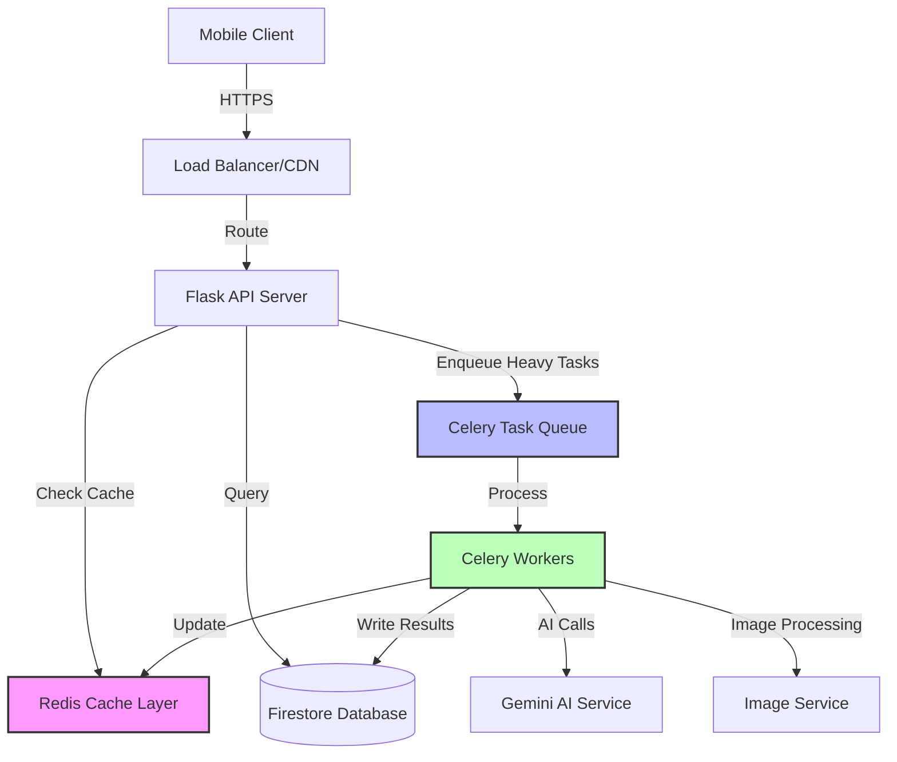

# Design Document: Backend Performance Optimization

## Overview

This design document outlines comprehensive performance optimization strategies for the Recipe App Flask backend. The optimization focuses on four key areas: **intelligent caching strategies**, **database query optimization with indexing**, **asynchronous processing for heavy operations**, and **API response optimization**. Current analysis reveals performance bottlenecks in Firestore queries (sequential document fetching), synchronous AI API calls (Gemini), image processing operations, and cache invalidation patterns. The proposed solution implements multi-layer caching (Redis + in-memory), Firestore composite indexes, async task queues (Celery), database connection pooling, and response compression to achieve sub-200ms response times for cached requests and sub-2s for complex AI operations.

## Architecture



### Performance Flow Diagram

```mermaid
sequenceDiagram
    participant Client
    participant API
    participant Cache
    participant Queue
    participant Worker
    participant DB
    participant AI
    
    Client->>API: Request /api/v1/ai/suggest-recipes
    API->>Cache: Check cache key
    
    alt Cache Hit
        Cache-->>API: Return cached data
        API-->>Client: Response (50-100ms)
    else Cache Miss
        API->>Queue: Enqueue AI task
        API-->>Client: Return task_id (immediate)
        Queue->>Worker: Process task
        Worker->>AI: Call Gemini API
        AI-->>Worker: AI response
        Worker->>DB: Fetch user profile
        Worker->>Cache: Store result
        Worker->>DB: Update task status
        Client->>API: Poll /api/v1/tasks/{task_id}
        API->>Cache: Check result
        Cache-->>API: Task result
        API-->>Client: Final response
    end

## Correctness Properties

*A property is a characteristic or behavior that should hold true across all valid executions of a system—essentially, a formal statement about what the system should do. Properties serve as the bridge between human-readable specifications and machine-verifiable correctness guarantees.*

### Property 1: Cache Round-Trip Preservation

*For any* cache key and data value, storing the data with a TTL and retrieving it before expiration SHALL return the same data value.

**Validates: Requirements 1.4**

### Property 2: Cache Key Uniqueness and Consistency

*For any* set of request parameters, generating a cache key SHALL produce the same hash for identical parameters and different hashes for different parameters.

**Validates: Requirements 1.5**

### Property 3: Cached Response Indicator

*For any* API request that is served from cache, the response SHALL include a "cached": true field in the JSON response body.

**Validates: Requirements 2.4**

### Property 4: Cache Invalidation on User Actions

*For any* user who creates a post or likes content, the Cache_System SHALL remove that user's community feed cache entry.

**Validates: Requirements 3.5**

### Property 5: Rate Limit Violation Response

*For any* API endpoint where the rate limit is exceeded, the API_Gateway SHALL return HTTP status code 429 with an error message.

**Validates: Requirements 4.5**

### Property 6: API Version Routing Equivalence

*For any* API endpoint, calling the legacy route /api/{endpoint} and the versioned route /api/v1/{endpoint} with identical parameters SHALL return equivalent responses.

**Validates: Requirements 6.5**

### Property 7: Request Logging Completeness

*For any* incoming HTTP request, the API_Gateway SHALL log an entry containing method, path, remote address, user agent, and user ID fields.

**Validates: Requirements 7.1**

### Property 8: Response Logging Completeness

*For any* outgoing HTTP response, the API_Gateway SHALL log an entry containing status code, duration in milliseconds, and content length fields.

**Validates: Requirements 7.2**

### Property 9: Log Data Sanitization

*For any* log entry containing sensitive data (passwords, tokens, API keys, authorization headers), the logged value SHALL be replaced with a redacted placeholder.

**Validates: Requirements 7.3, 12.3**

### Property 10: Log Level Assignment for Success

*For any* HTTP request that completes with status code in the range 200-299, the API_Gateway SHALL log the response at INFO level.

**Validates: Requirements 7.4**

### Property 11: Log Level Assignment for Client Errors

*For any* HTTP request that completes with status code in the range 400-499, the API_Gateway SHALL log the response at WARNING level.

**Validates: Requirements 7.5**

### Property 12: Log Level Assignment for Server Errors

*For any* HTTP request that completes with status code in the range 500-599, the API_Gateway SHALL log the response at ERROR level.

**Validates: Requirements 7.6**

### Property 13: Asynchronous Task Immediate Response

*For any* heavy AI operation request, the API_Gateway SHALL return a response containing a task ID within 100 milliseconds without waiting for the operation to complete.

**Validates: Requirements 8.2**

### Property 14: Async Task Result Caching

*For any* asynchronous task that completes successfully, the Worker_Process SHALL store the result in the Cache_System with the task ID as part of the cache key.

**Validates: Requirements 8.3**

### Property 15: Task Completion Status Update

*For any* asynchronous task that completes (successfully or with error), the Worker_Process SHALL update the task status in the Database.

**Validates: Requirements 8.5**

### Property 16: Cache Clearing Effectiveness

*For any* cache key that exists in the Cache_System, calling the cache clear operation for that key SHALL result in the key no longer being present in the cache.

**Validates: Requirements 10.4**

### Property 17: Slow Request Logging

*For any* HTTP request that takes longer than 1000 milliseconds to complete, the API_Gateway SHALL log the request as a slow request with duration details.

**Validates: Requirements 11.4**

### Property 18: User-Specific Cache Keys for Personalized Data

*For any* personalized data cached for a user, the cache key SHALL include the user ID to ensure data isolation between users.

**Validates: Requirements 12.1**

### Property 19: No Caching of Sensitive Responses

*For any* HTTP response containing authentication tokens or sensitive user credentials, the Cache_System SHALL NOT store the response in cache.

**Validates: Requirements 12.2**

### Property 20: Rate Limit Counter Privacy

*For any* HTTP response from the API_Gateway, the response body SHALL NOT expose internal rate limit counter values.

**Validates: Requirements 12.5**

### Property 21: Cache Read Failure Resilience

*For any* cache read operation that fails, the API_Gateway SHALL fetch the data from the Database and continue processing the request without returning an error to the client.

**Validates: Requirements 13.2**

### Property 22: Cache Write Failure Resilience

*For any* cache write operation that fails, the API_Gateway SHALL log the error and continue processing the request without returning an error to the client.

**Validates: Requirements 13.3**

### Property 23: Error Response Appropriateness

*For any* error scenario (validation failure, resource not found, server error), the API_Gateway SHALL return an HTTP response with an appropriate status code and a descriptive error message.

**Validates: Requirements 13.5**
