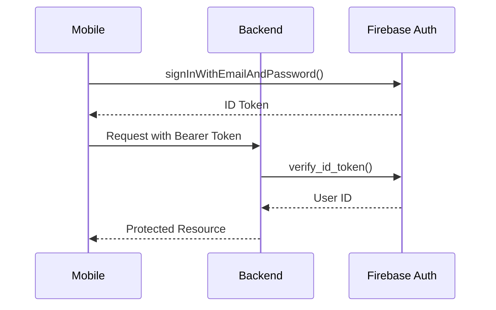
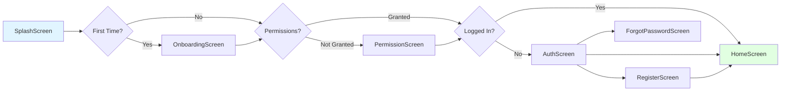
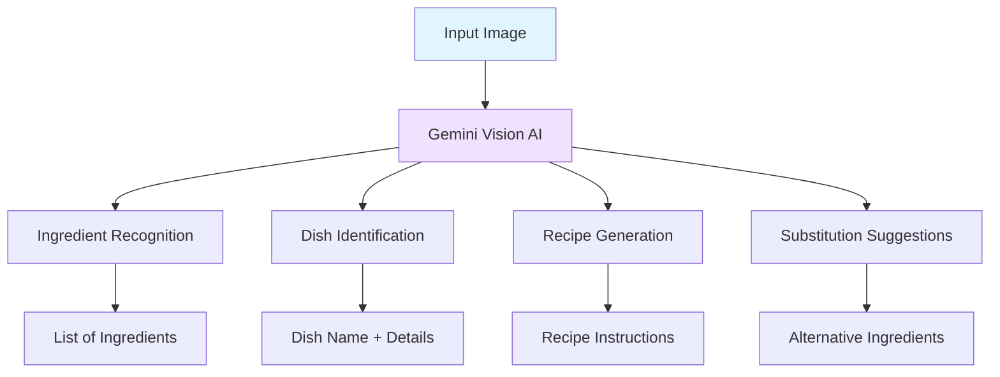
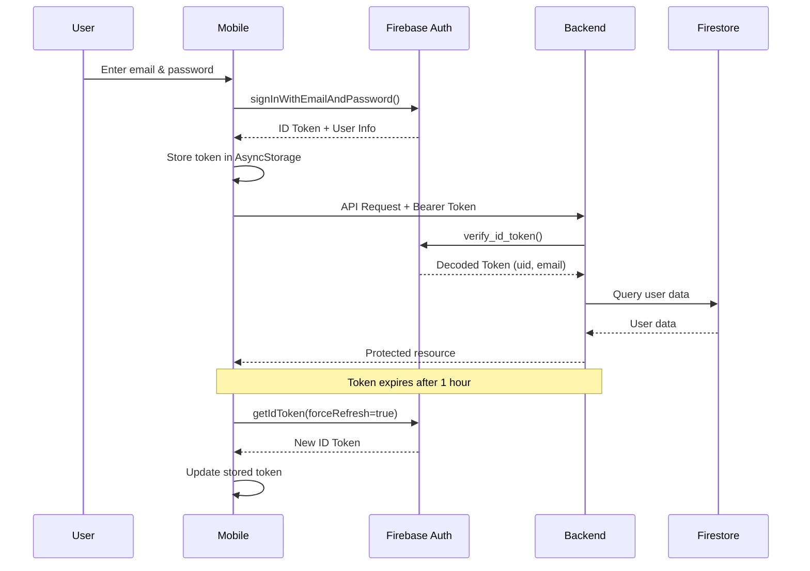

# Tài Liệu Thiết Kế Kỹ Thuật: Smart Cooking AI

## Tổng Quan

Smart Cooking AI là ứng dụng di động thông minh giúp người dùng nấu ăn dễ dàng hơn bằng cách sử dụng AI để nhận diện nguyên liệu từ ảnh, gợi ý công thức món ăn phù hợp với hồ sơ sức khỏe cá nhân, và cung cấp hướng dẫn nấu ăn từng bước với voice guide. Ứng dụng tích hợp cộng đồng chia sẻ món ăn, quản lý tủ lạnh ảo, danh sách mua sắm, kế hoạch bữa ăn, và theo dõi dinh dưỡng.

**Công nghệ chính:**
- **Frontend Mobile**: React Native 0.81.5 + Expo ~54.0
- **Backend API**: Flask 3.0.0 + Python
- **AI Engine**: Google Gemini Vision AI (gemini-1.5-flash)
- **Database**: Firebase Firestore
- **Authentication**: Firebase Auth
- **Deployment**: Render (Backend)

**Đặc điểm nổi bật:**
- Nhận diện nguyên liệu và món ăn bằng AI Vision
- Gợi ý công thức dựa trên nguyên liệu có sẵn và hồ sơ sức khỏe
- Chế độ nấu ăn từng bước với voice guide
- Cộng đồng chia sẻ món ăn
- Quản lý tủ lạnh ảo và danh sách mua sắm
- Theo dõi dinh dưỡng và kế hoạch bữa ăn
- Gamification (challenges, leaderboard)
- Hỗ trợ offline với AsyncStorage

## Kiến Trúc Hệ Thống

```mermaid
graph TB
    subgraph "Mobile App (React Native + Expo)"
        UI[User Interface]
        NAV[React Navigation]
        STATE[AsyncStorage]
        CAMERA[expo-camera]
        NOTIF[expo-notifications]
        SPEECH[expo-speech]
    end
    
    subgraph "Backend API (Flask)"
        API[Flask REST API]
        AUTH[Auth Middleware]
        AI[AI Service]
        OCR[OCR Service]
        IMG[Image Service]
    end
    
    subgraph "External Services"
        GEMINI[Google Gemini Vision AI]
        FIREBASE[Firebase Auth]
        FIRESTORE[Firebase Firestore]
        BING[Bing Image Search]
    end
    
    UI --> NAV
    NAV --> STATE
    UI --> CAMERA
    UI --> NOTIF
    UI --> SPEECH
    
    UI -->|HTTPS/REST| API
    API --> AUTH
    AUTH --> FIREBASE
    API --> AI
    API --> OCR
    API --> IMG
    
    AI --> GEMINI
    OCR --> GEMINI
    IMG --> BING
    API --> FIRESTORE
    
    style UI fill:#e1f5ff
    style API fill:#fff4e1
    style GEMINI fill:#f0e1ff
    style FIRESTORE fill:#e1ffe1


## Luồng Hoạt Động Chính

```mermaid
sequenceDiagram
    participant User
    participant Mobile
    participant Backend
    participant Gemini AI
    participant Firestore
    
    User->>Mobile: Mở ứng dụng
    Mobile->>Backend: Đăng nhập (Firebase Auth)
    Backend->>Firestore: Xác thực token
    Firestore-->>Backend: Token hợp lệ
    Backend-->>Mobile: Đăng nhập thành công
    
    User->>Mobile: Quét nguyên liệu bằng camera
    Mobile->>Backend: POST /api/scan-ingredients (image)
    Backend->>Gemini AI: Nhận diện nguyên liệu
    Gemini AI-->>Backend: Danh sách nguyên liệu
    Backend-->>Mobile: JSON ingredients
    
    User->>Mobile: Xác nhận nguyên liệu
    Mobile->>Backend: POST /api/suggest-recipes (ingredients + health_profile)
    Backend->>Firestore: Kiểm tra cache
    alt Cache hit
        Firestore-->>Backend: Cached recipes
    else Cache miss
        Backend->>Gemini AI: Gợi ý công thức
        Gemini AI-->>Backend: Danh sách công thức
        Backend->>Firestore: Lưu cache
    end
    Backend-->>Mobile: JSON recipes
    
    User->>Mobile: Chọn món ăn
    Mobile->>Mobile: Hiển thị công thức chi tiết
    
    User->>Mobile: Bắt đầu nấu (Cooking Mode)
    Mobile->>Mobile: Hướng dẫn từng bước + Voice guide
    
    User->>Mobile: Hoàn thành nấu ăn
    Mobile->>Backend: POST /api/user/sync-history
    Backend->>Firestore: Lưu lịch sử nấu ăn
    
    User->>Mobile: Lưu vào yêu thích
    Mobile->>Backend: POST /api/favorites
    Backend->>Firestore: Lưu món yêu thích
    
    User->>Mobile: Chia sẻ lên cộng đồng
    Mobile->>Backend: POST /api/community/posts
    Backend->>Firestore: Tạo bài viết


## Kiến Trúc Frontend (Mobile)

### Cấu Trúc Thư Mục

```
mobile/
├── src/
│   ├── screens/          # 40+ màn hình
│   ├── components/       # UI components tái sử dụng
│   ├── navigation/       # React Navigation setup
│   ├── services/         # API services
│   ├── utils/            # Utility functions
│   └── assets/           # Images, fonts
├── app.json              # Expo configuration
├── package.json          # Dependencies
└── index.ts              # Entry point
```

### Navigation Structure

```mermaid
graph TD
    ROOT[Root Navigator]
    
    ROOT --> AUTH[Auth Stack]
    ROOT --> MAIN[Main Stack]
    
    AUTH --> SPLASH[SplashScreen]
    AUTH --> ONBOARD[OnboardingScreen]
    AUTH --> PERM[PermissionScreen]
    AUTH --> LOGIN[AuthScreen]
    AUTH --> REG[RegisterScreen]
    AUTH --> FORGOT[ForgotPasswordScreen]
    
    MAIN --> TABS[Bottom Tabs]
    MAIN --> MODAL[Modal Screens]
    
    TABS --> HOME[HomeScreen]
    TABS --> COMMUNITY[CommunityScreen]
    TABS --> FAVORITES[FavoritesScreen]
    TABS --> PROFILE[ProfileScreen]
    
    MODAL --> CAMERA[CameraScreen]
    MODAL --> INGREDIENT[IngredientInputScreen]
    MODAL --> REVIEW[IngredientReviewScreen]
    MODAL --> AIRESULT[AIResultScreen]
    MODAL --> DISH[DishResultScreen]
    MODAL --> COOKING[CookingModeScreen]
    MODAL --> PREP[PrepChecklistScreen]
    MODAL --> COMPLETE[CookingCompleteScreen]
    MODAL --> CUSTOMIZE[RecipeCustomizeScreen]
    MODAL --> MISSING[MissingIngredientsScreen]
    MODAL --> INVENTORY[InventoryScreen]
    MODAL --> SHOPPING[ShoppingListScreen]
    MODAL --> MEALPLAN[MealPlannerScreen]
    MODAL --> NUTRITION[NutritionDiaryScreen]
    MODAL --> HEALTH[HealthProfileScreen]
    MODAL --> SETTINGS[SettingsScreen]
    MODAL --> HISTORY[CookingHistoryScreen]
    MODAL --> SCAN[ScanHistoryScreen]
    MODAL --> CHALLENGES[ChallengesScreen]
    MODAL --> LEADER[LeaderboardScreen]
    MODAL --> PRO[ProUpgradeScreen]
    MODAL --> SHOP[OnlineShoppingScreen]
    
    style ROOT fill:#e1f5ff
    style TABS fill:#fff4e1
    style AUTH fill:#f0e1ff
    style MODAL fill:#e1ffe1
```



### Core Components

#### 1. GlassCard Component
```typescript
interface GlassCardProps {
  children: React.ReactNode;
  style?: ViewStyle;
  blur?: number;
  opacity?: number;
}

// Glassmorphism effect card với blur background
const GlassCard: React.FC<GlassCardProps> = ({
  children,
  style,
  blur = 10,
  opacity = 0.8
}) => {
  return (
    <BlurView intensity={blur} style={[styles.card, style]}>
      <View style={{ opacity }}>{children}</View>
    </BlurView>
  );
};
```

#### 2. AnimatedButton Component
```typescript
interface AnimatedButtonProps {
  title: string;
  onPress: () => void;
  variant?: 'primary' | 'secondary' | 'outline';
  icon?: string;
  loading?: boolean;
  disabled?: boolean;
}

// Button với animation và haptic feedback
const AnimatedButton: React.FC<AnimatedButtonProps> = ({
  title,
  onPress,
  variant = 'primary',
  icon,
  loading,
  disabled
}) => {
  const scale = useRef(new Animated.Value(1)).current;
  
  const handlePress = () => {
    Haptics.impactAsync(Haptics.ImpactFeedbackStyle.Medium);
    Animated.sequence([
      Animated.timing(scale, { toValue: 0.95, duration: 100 }),
      Animated.timing(scale, { toValue: 1, duration: 100 })
    ]).start();
    onPress();
  };
  
  return (
    <Animated.View style={{ transform: [{ scale }] }}>
      <TouchableOpacity onPress={handlePress} disabled={disabled || loading}>
        {icon && <Icon name={icon} />}
        <Text>{loading ? 'Loading...' : title}</Text>
      </TouchableOpacity>
    </Animated.View>
  );
};
```

### State Management

```typescript
// AsyncStorage keys
const STORAGE_KEYS = {
  USER_TOKEN: '@user_token',
  USER_PROFILE: '@user_profile',
  HEALTH_PROFILE: '@health_profile',
  FAVORITES: '@favorites',
  COOKING_HISTORY: '@cooking_history',
  INVENTORY: '@inventory',
  SHOPPING_LIST: '@shopping_list',
  MEAL_PLAN: '@meal_plan',
  NUTRITION_DIARY: '@nutrition_diary',
  SCAN_HISTORY: '@scan_history',
  SETTINGS: '@settings'
};

// Storage service
class StorageService {
  static async save(key: string, value: any): Promise<void> {
    try {
      await AsyncStorage.setItem(key, JSON.stringify(value));
    } catch (error) {
      console.error('Storage save error:', error);
    }
  }
  
  static async load(key: string): Promise<any> {
    try {
      const value = await AsyncStorage.getItem(key);
      return value ? JSON.parse(value) : null;
    } catch (error) {
      console.error('Storage load error:', error);
      return null;
    }
  }
  
  static async remove(key: string): Promise<void> {
    try {
      await AsyncStorage.removeItem(key);
    } catch (error) {
      console.error('Storage remove error:', error);
    }
  }
  
  static async clear(): Promise<void> {
    try {
      await AsyncStorage.clear();
    } catch (error) {
      console.error('Storage clear error:', error);
    }
  }
}
```

### API Service

```typescript
// API configuration
const API_BASE_URL = 'https://your-backend.render.com';

interface ApiResponse<T> {
  data?: T;
  error?: string;
  message?: string;
}

class ApiService {
  private static token: string | null = null;
  
  static setToken(token: string) {
    this.token = token;
  }
  
  static async request<T>(
    endpoint: string,
    method: 'GET' | 'POST' | 'PATCH' | 'DELETE' = 'GET',
    body?: any,
    isFormData: boolean = false
  ): Promise<ApiResponse<T>> {
    try {
      const headers: HeadersInit = {
        ...(this.token && { Authorization: `Bearer ${this.token}` }),
        ...(!isFormData && { 'Content-Type': 'application/json' })
      };
      
      const config: RequestInit = {
        method,
        headers,
        ...(body && {
          body: isFormData ? body : JSON.stringify(body)
        })
      };
      
      const response = await fetch(`${API_BASE_URL}${endpoint}`, config);
      const data = await response.json();
      
      if (!response.ok) {
        return { error: data.error || 'Request failed' };
      }
      
      return { data };
    } catch (error) {
      return { error: error.message || 'Network error' };
    }
  }
  
  // Scan ingredients
  static async scanIngredients(imageUri: string): Promise<ApiResponse<string[]>> {
    const formData = new FormData();
    formData.append('image', {
      uri: imageUri,
      type: 'image/jpeg',
      name: 'ingredient.jpg'
    } as any);
    
    return this.request<string[]>('/api/scan-ingredients', 'POST', formData, true);
  }
  
  // Suggest recipes
  static async suggestRecipes(
    ingredients: string[],
    healthProfile?: any
  ): Promise<ApiResponse<Recipe[]>> {
    return this.request<Recipe[]>('/api/suggest-recipes', 'POST', {
      ingredients,
      health_profile: healthProfile
    });
  }
  
  // Scan and suggest (one-step)
  static async scanAndSuggest(
    imageUri: string,
    healthProfile?: any
  ): Promise<ApiResponse<{ ingredients: string[]; recipes: Recipe[] }>> {
    const formData = new FormData();
    formData.append('image', {
      uri: imageUri,
      type: 'image/jpeg',
      name: 'scan.jpg'
    } as any);
    if (healthProfile) {
      formData.append('health_profile', JSON.stringify(healthProfile));
    }
    
    return this.request('/api/scan-and-suggest', 'POST', formData, true);
  }
  
  // Identify dish
  static async identifyDish(
    imageUri: string,
    mode: 'quick' | 'detail' = 'detail'
  ): Promise<ApiResponse<DishInfo>> {
    const formData = new FormData();
    formData.append('image', {
      uri: imageUri,
      type: 'image/jpeg',
      name: 'dish.jpg'
    } as any);
    
    return this.request<DishInfo>(
      `/api/identify-dish?mode=${mode}`,
      'POST',
      formData,
      true
    );
  }
  
  // Get favorites
  static async getFavorites(): Promise<ApiResponse<Recipe[]>> {
    return this.request<Recipe[]>('/api/favorites', 'GET');
  }
  
  // Add favorite
  static async addFavorite(recipe: Recipe): Promise<ApiResponse<{ id: string }>> {
    return this.request('/api/favorites', 'POST', recipe);
  }
  
  // Delete favorite
  static async deleteFavorite(id: string): Promise<ApiResponse<void>> {
    return this.request(`/api/favorites/${id}`, 'DELETE');
  }
  
  // Sync user data
  static async syncNutrition(data: any): Promise<ApiResponse<void>> {
    return this.request('/api/user/sync-nutrition', 'POST', data);
  }
  
  static async syncHealth(data: any): Promise<ApiResponse<void>> {
    return this.request('/api/user/sync-health', 'POST', data);
  }
  
  static async syncHistory(data: any): Promise<ApiResponse<void>> {
    return this.request('/api/user/sync-history', 'POST', data);
  }
  
  static async syncInventory(data: any): Promise<ApiResponse<void>> {
    return this.request('/api/user/sync-inventory', 'POST', data);
  }
  
  static async syncShopping(data: any): Promise<ApiResponse<void>> {
    return this.request('/api/user/sync-shopping', 'POST', data);
  }
  
  static async syncMealPlan(data: any): Promise<ApiResponse<void>> {
    return this.request('/api/user/sync-mealplan', 'POST', data);
  }
  
  static async syncProfile(data: any): Promise<ApiResponse<void>> {
    return this.request('/api/user/sync-profile', 'POST', data);
  }
  
  static async syncScanHistory(data: any): Promise<ApiResponse<void>> {
    return this.request('/api/user/sync-scan-history', 'POST', data);
  }
  
  // Get user data
  static async getUserData(): Promise<ApiResponse<UserData>> {
    return this.request<UserData>('/api/user/data', 'GET');
  }
  
  // Community APIs
  static async getCommunityFeed(): Promise<ApiResponse<Post[]>> {
    return this.request<Post[]>('/api/community/feed', 'GET');
  }
  
  static async createPost(post: CreatePostData): Promise<ApiResponse<{ id: string }>> {
    return this.request('/api/community/posts', 'POST', post);
  }
  
  static async likePost(postId: string): Promise<ApiResponse<void>> {
    return this.request(`/api/community/posts/${postId}/like`, 'POST');
  }
  
  static async unlikePost(postId: string): Promise<ApiResponse<void>> {
    return this.request(`/api/community/posts/${postId}/like`, 'DELETE');
  }
  
  static async bookmarkPost(postId: string): Promise<ApiResponse<void>> {
    return this.request(`/api/community/posts/${postId}/bookmark`, 'POST');
  }
  
  static async unbookmarkPost(postId: string): Promise<ApiResponse<void>> {
    return this.request(`/api/community/posts/${postId}/bookmark`, 'DELETE');
  }
  
  static async getComments(postId: string): Promise<ApiResponse<Comment[]>> {
    return this.request<Comment[]>(`/api/community/posts/${postId}/comments`, 'GET');
  }
  
  static async addComment(postId: string, text: string): Promise<ApiResponse<void>> {
    return this.request(`/api/community/posts/${postId}/comments`, 'POST', { text });
  }
}
```


## Kiến Trúc Backend (Flask API)

### Cấu Trúc Thư Mục

```
backend/
├── app.py                # Main Flask application
├── ai_service.py         # Gemini AI integration
├── ocr_service.py        # Image processing & OCR
├── image_service.py      # Bing image search
├── auth_middleware.py    # Firebase Auth middleware
├── requirements.txt      # Python dependencies
├── runtime.txt           # Python version
├── .env                  # Environment variables
├── serviceAccountKey.json # Firebase credentials
└── uploads/              # Temporary image storage
```

### Core Services

#### 1. AI Service (ai_service.py)

```python
import google.generativeai as genai
from typing import List, Dict, Optional

class AIService:
    """Service for Gemini AI integration"""
    
    def __init__(self, api_key: str):
        genai.configure(api_key=api_key)
        self.model = genai.GenerativeModel("gemini-1.5-flash")
    
    def generate_recipes(
        self,
        ingredients: List[str],
        health_profile: Optional[Dict] = None
    ) -> List[Dict]:
        """
        Generate recipe suggestions based on ingredients and health profile
        
        Preconditions:
        - ingredients is non-empty list of strings
        - health_profile is optional dict with dietary restrictions
        
        Postconditions:
        - Returns list of recipe dicts with name, ingredients, instructions
        - Each recipe is suitable for given health profile
        """
        prompt = self._build_recipe_prompt(ingredients, health_profile)
        response = self.model.generate_content(prompt)
        recipes = self._parse_recipe_response(response.text)
        return recipes
    
    def _build_recipe_prompt(
        self,
        ingredients: List[str],
        health_profile: Optional[Dict]
    ) -> str:
        """Build prompt for recipe generation"""
        base_prompt = f"""Bạn là chuyên gia ẩm thực Việt Nam.
Dựa trên các nguyên liệu sau: {', '.join(ingredients)}

Hãy gợi ý 3-5 món ăn Việt Nam phù hợp."""
        
        if health_profile:
            restrictions = []
            if health_profile.get('isVegetarian'):
                restrictions.append('chay')
            if health_profile.get('allergies'):
                restrictions.append(f"dị ứng: {', '.join(health_profile['allergies'])}")
            if health_profile.get('dietaryGoal'):
                restrictions.append(f"mục tiêu: {health_profile['dietaryGoal']}")
            
            if restrictions:
                base_prompt += f"\n\nYêu cầu đặc biệt: {', '.join(restrictions)}"
        
        base_prompt += """

Trả về JSON hợp lệ (chỉ JSON, không markdown):
{
  "recipes": [
    {
      "name": "Tên món",
      "description": "Mô tả ngắn",
      "ingredients": ["nguyên liệu 1", "nguyên liệu 2"],
      "instructions": "Bước 1: ... Bước 2: ...",
      "prep_time": "30 phút",
      "difficulty": "Dễ",
      "calories": "350 kcal",
      "nutrition": {
        "protein": "20g",
        "carbs": "45g",
        "fat": "10g"
      }
    }
  ]
}"""
        return base_prompt
    
    def _parse_recipe_response(self, response_text: str) -> List[Dict]:
        """Parse AI response to extract recipes"""
        import json
        import re
        
        # Remove markdown code blocks
        cleaned = response_text.strip()
        if cleaned.startswith("```"):
            cleaned = cleaned.split("```", 2)[1]
            if cleaned.startswith("json"):
                cleaned = cleaned[4:]
            cleaned = cleaned.strip()
        
        # Extract JSON object
        match = re.search(r'(\{.*\})', cleaned, re.DOTALL)
        if match:
            cleaned = match.group(1)
        
        data = json.loads(cleaned)
        return data.get('recipes', [])
    
    def suggest_substitutions(self, ingredient: str) -> List[str]:
        """
        Suggest ingredient substitutions
        
        Preconditions:
        - ingredient is non-empty string
        
        Postconditions:
        - Returns list of 3-5 substitute ingredients
        """
        prompt = f"""Gợi ý 3-5 nguyên liệu thay thế cho: {ingredient}
Trả về JSON: {{"substitutions": ["thay thế 1", "thay thế 2", ...]}}"""
        
        response = self.model.generate_content(prompt)
        data = self._parse_recipe_response(response.text)
        return data.get('substitutions', [])
```

#### 2. OCR Service (ocr_service.py)

```python
from PIL import Image
import google.generativeai as genai
from typing import List, Dict, Optional

class OCRService:
    """Service for image processing and ingredient recognition"""
    
    def __init__(self, api_key: str):
        genai.configure(api_key=api_key)
        self.model = genai.GenerativeModel("gemini-1.5-flash")
    
    def process_image_for_ingredients(self, image_path: str) -> List[str]:
        """
        Extract ingredients from image using Gemini Vision AI
        
        Preconditions:
        - image_path points to valid image file
        - Image is readable by PIL
        
        Postconditions:
        - Returns list of ingredient names in Vietnamese
        - Empty list if no ingredients detected
        """
        img = Image.open(image_path)
        
        prompt = """Bạn là chuyên gia nhận diện thực phẩm.
Hãy nhìn vào hình ảnh và liệt kê TẤT CẢ các nguyên liệu thực phẩm bạn nhìn thấy.

Trả về JSON hợp lệ (chỉ JSON, không markdown):
{
  "ingredients": ["nguyên liệu 1", "nguyên liệu 2", ...]
}

Yêu cầu:
1. Tên nguyên liệu bằng tiếng Việt
2. Chỉ liệt kê thực phẩm, không liệt kê đồ dùng
3. Ước lượng số lượng nếu có thể (vd: "2 quả cà chua")
"""
        
        response = self.model.generate_content([prompt, img])
        data = self._parse_json_response(response.text)
        return data.get('ingredients', [])
    
    def process_image_for_all(
        self,
        image_path: str,
        health_profile: Optional[Dict] = None
    ) -> Dict:
        """
        One-step processing: detect ingredients and suggest recipes
        
        Preconditions:
        - image_path points to valid image file
        - health_profile is optional dict
        
        Postconditions:
        - Returns dict with 'ingredients' and 'recipes' keys
        """
        img = Image.open(image_path)
        
        prompt = self._build_all_in_one_prompt(health_profile)
        response = self.model.generate_content([prompt, img])
        data = self._parse_json_response(response.text)
        
        return {
            'ingredients': data.get('ingredients', []),
            'recipes': data.get('recipes', [])
        }
    
    def _build_all_in_one_prompt(self, health_profile: Optional[Dict]) -> str:
        """Build prompt for one-step processing"""
        prompt = """Bạn là chuyên gia ẩm thực Việt Nam.

Bước 1: Nhìn vào hình ảnh và liệt kê TẤT CẢ nguyên liệu thực phẩm.
Bước 2: Dựa trên các nguyên liệu đó, gợi ý 3-5 món ăn Việt Nam."""
        
        if health_profile:
            restrictions = []
            if health_profile.get('isVegetarian'):
                restrictions.append('chay')
            if health_profile.get('allergies'):
                restrictions.append(f"dị ứng: {', '.join(health_profile['allergies'])}")
            
            if restrictions:
                prompt += f"\n\nYêu cầu đặc biệt: {', '.join(restrictions)}"
        
        prompt += """

Trả về JSON hợp lệ (chỉ JSON, không markdown):
{
  "ingredients": ["nguyên liệu 1", "nguyên liệu 2"],
  "recipes": [
    {
      "name": "Tên món",
      "description": "Mô tả",
      "ingredients": ["nguyên liệu 1", "nguyên liệu 2"],
      "instructions": "Bước 1: ... Bước 2: ...",
      "prep_time": "30 phút",
      "difficulty": "Dễ",
      "calories": "350 kcal"
    }
  ]
}"""
        return prompt
    
    def _parse_json_response(self, response_text: str) -> Dict:
        """Parse JSON from AI response"""
        import json
        import re
        
        cleaned = response_text.strip()
        if cleaned.startswith("```"):
            cleaned = cleaned.split("```", 2)[1]
            if cleaned.startswith("json"):
                cleaned = cleaned[4:]
            cleaned = cleaned.strip()
        
        match = re.search(r'(\{.*\})', cleaned, re.DOTALL)
        if match:
            cleaned = match.group(1)
        
        return json.loads(cleaned)
```

#### 3. Auth Middleware (auth_middleware.py)

```python
from functools import wraps
from flask import request, jsonify
from firebase_admin import auth as fb_auth

def require_auth(f):
    """
    Decorator to require Firebase authentication
    
    Preconditions:
    - Request has Authorization header with Bearer token
    
    Postconditions:
    - Sets request.user_id to authenticated user ID
    - Returns 401 if authentication fails
    """
    @wraps(f)
    def decorated_function(*args, **kwargs):
        auth_header = request.headers.get('Authorization')
        
        if not auth_header or not auth_header.startswith('Bearer '):
            return jsonify({'error': 'Missing or invalid authorization header'}), 401
        
        token = auth_header.split(' ')[1]
        
        # Support local development tokens
        if token.startswith('local-token:'):
            user_id = token.split(':')[1].replace('.', '_').replace('@', '_')
            request.user_id = user_id
            return f(*args, **kwargs)
        
        # Verify Firebase token
        try:
            decoded_token = fb_auth.verify_id_token(token)
            request.user_id = decoded_token['uid']
            return f(*args, **kwargs)
        except Exception as e:
            return jsonify({'error': 'Invalid or expired token'}), 401
    
    return decorated_function
```

#### 4. Image Service (image_service.py)

```python
import requests
from typing import Optional

class ImageService:
    """Service for fetching real food images"""
    
    def __init__(self, bing_api_key: str):
        self.api_key = bing_api_key
        self.endpoint = "https://api.bing.microsoft.com/v7.0/images/search"
    
    def get_image_url_from_bing(self, query: str) -> Optional[str]:
        """
        Search for food image using Bing Image Search API
        
        Preconditions:
        - query is non-empty string
        - API key is valid
        
        Postconditions:
        - Returns image URL if found
        - Returns None if no image found or API error
        """
        headers = {"Ocp-Apim-Subscription-Key": self.api_key}
        params = {
            "q": query,
            "count": 1,
            "imageType": "Photo",
            "safeSearch": "Strict"
        }
        
        try:
            response = requests.get(self.endpoint, headers=headers, params=params)
            response.raise_for_status()
            data = response.json()
            
            if data.get('value'):
                return data['value'][0]['contentUrl']
            return None
        except Exception as e:
            print(f"[IMAGE-SERVICE] Error: {e}")
            return None
```


## API Endpoints

### Authentication Flow



### Core API Endpoints

#### 1. Health Check
```
GET /
GET /api/health

Response:
{
  "status": "online",
  "message": "Backend đang chạy!",
  "version": "1.0.0"
}
```

#### 2. Scan Ingredients
```
POST /api/scan-ingredients
Content-Type: multipart/form-data

Request:
- image: File (JPEG/PNG)

Response:
{
  "ingredients": ["cà chua", "hành tây", "thịt bò"]
}
```

#### 3. Suggest Recipes
```
POST /api/suggest-recipes
Content-Type: application/json

Request:
{
  "ingredients": ["cà chua", "hành tây", "thịt bò"],
  "health_profile": {
    "isVegetarian": false,
    "allergies": ["đậu phộng"],
    "dietaryGoal": "giảm cân"
  }
}

Response:
{
  "recipes": [
    {
      "name": "Bò xào cà chua",
      "description": "Món ăn đơn giản, bổ dưỡng",
      "ingredients": ["300g thịt bò", "2 quả cà chua", "1 củ hành tây"],
      "instructions": "Bước 1: Thái thịt bò...",
      "prep_time": "30 phút",
      "difficulty": "Dễ",
      "calories": "350 kcal",
      "nutrition": {
        "protein": "25g",
        "carbs": "15g",
        "fat": "20g"
      }
    }
  ]
}
```

#### 4. Scan and Suggest (One-Step)
```
POST /api/scan-and-suggest
Authorization: Bearer <token>
Content-Type: multipart/form-data

Request:
- image: File
- health_profile: JSON string (optional)

Response:
{
  "ingredients": ["cà chua", "hành tây"],
  "recipes": [...]
}

Quota: 3 requests per day for free users
Error (403): "Bạn đã hết lượt sử dụng AI miễn phí hôm nay"
```

#### 5. Identify Dish
```
POST /api/identify-dish?mode=detail
Content-Type: multipart/form-data

Request:
- image: File
- mode: "quick" | "detail" (query param)

Response (quick mode):
{
  "dish": {
    "dish_name": "Phở bò",
    "description": "Món ăn truyền thống Việt Nam",
    "confidence": 95,
    "alternatives": ["Phở gà", "Bún bò"],
    "origin": "Hà Nội"
  },
  "mode": "quick"
}

Response (detail mode):
{
  "dish": {
    "dish_name": "Phở bò",
    "description": "Món ăn truyền thống...",
    "ingredients": ["bánh phở", "thịt bò", "hành"],
    "instructions": "Bước 1: Nấu nước dùng...",
    "prep_time": "2 giờ",
    "difficulty": "Trung bình",
    "calories": "450 kcal",
    "tips": "Nước dùng phải trong và ngọt",
    "origin": "Hà Nội"
  },
  "mode": "detail"
}
```

#### 6. Search Image
```
GET /api/search-image?q=phở+bò

Response:
{
  "url": "https://example.com/pho-bo.jpg"
}
```

#### 7. Suggest Substitutions
```
GET /api/suggest-substitutions?ingredient=nước+mắm

Response:
{
  "ingredient": "nước mắm",
  "substitutions": ["nước tương", "muối", "miso"]
}
```

### Favorites API

#### 8. Get Favorites
```
GET /api/favorites
Authorization: Bearer <token>

Response:
[
  {
    "id": "fav123",
    "user_id": "user456",
    "name": "Phở bò",
    "ingredients": [...],
    "instructions": "...",
    "created_at": "2024-01-15T10:30:00"
  }
]
```

#### 9. Add Favorite
```
POST /api/favorites
Authorization: Bearer <token>
Content-Type: application/json

Request:
{
  "name": "Phở bò",
  "description": "...",
  "ingredients": [...],
  "instructions": "..."
}

Response:
{
  "message": "Đã lưu vào yêu thích",
  "id": "fav123"
}
```

#### 10. Delete Favorite
```
DELETE /api/favorites/<fav_id>
Authorization: Bearer <token>

Response:
{
  "message": "Đã xóa thành công"
}
```

### User Data Sync API

#### 11. Sync Nutrition
```
POST /api/user/sync-nutrition
Authorization: Bearer <token>
Content-Type: application/json

Request:
{
  "calorieTarget": 2000,
  "waterTarget": 2000,
  "currentCalories": 1500,
  "entries": [
    {
      "meal": "Sáng",
      "food": "Phở",
      "calories": 450,
      "time": "2024-01-15T07:00:00"
    }
  ]
}

Response:
{
  "message": "Đã đồng bộ dinh dưỡng thành công"
}
```

#### 12. Sync Health Profile
```
POST /api/user/sync-health
Authorization: Bearer <token>

Request:
{
  "age": 25,
  "gender": "male",
  "height": 170,
  "weight": 65,
  "isVegetarian": false,
  "allergies": ["đậu phộng"],
  "dietaryGoal": "giảm cân"
}
```

#### 13. Sync Cooking History
```
POST /api/user/sync-history
Authorization: Bearer <token>

Request:
[
  {
    "dishName": "Phở bò",
    "date": "2024-01-15T12:00:00",
    "rating": 5,
    "notes": "Rất ngon"
  }
]
```

#### 14. Sync Inventory (Tủ lạnh)
```
POST /api/user/sync-inventory
Authorization: Bearer <token>

Request:
[
  {
    "name": "Cà chua",
    "quantity": "5 quả",
    "expiryDate": "2024-01-20",
    "category": "Rau củ"
  }
]
```

#### 15. Sync Shopping List
```
POST /api/user/sync-shopping
Authorization: Bearer <token>

Request:
[
  {
    "name": "Thịt bò",
    "quantity": "500g",
    "checked": false,
    "category": "Thịt"
  }
]
```

#### 16. Sync Meal Plan
```
POST /api/user/sync-mealplan
Authorization: Bearer <token>

Request:
{
  "monday": {
    "breakfast": "Phở",
    "lunch": "Cơm gà",
    "dinner": "Bún chả"
  },
  "tuesday": {...}
}
```

#### 17. Sync Profile
```
POST /api/user/sync-profile
Authorization: Bearer <token>

Request:
{
  "displayName": "Nguyễn Văn A",
  "email": "user@example.com",
  "avatar": "https://...",
  "bio": "Yêu thích nấu ăn"
}
```

#### 18. Sync Scan History
```
POST /api/user/sync-scan-history
Authorization: Bearer <token>

Request:
[
  {
    "ingredients": ["cà chua", "hành"],
    "timestamp": "2024-01-15T10:00:00",
    "imageUrl": "..."
  }
]
```

#### 19. Get User Data
```
GET /api/user/data
Authorization: Bearer <token>

Response:
{
  "nutrition": {...},
  "health": {...},
  "history": [...],
  "inventory": [...],
  "shopping": [...],
  "mealPlan": {...},
  "profile": {...},
  "scanHistory": [...]
}
```

#### 20. Export User Data
```
GET /api/user/export
Authorization: Bearer <token>

Response: Complete user data including favorites and community posts
```

#### 21. Request Data Export
```
POST /api/user/request-export
Authorization: Bearer <token>

Request:
{
  "note": "Yêu cầu xuất dữ liệu"
}

Response:
{
  "message": "Đã ghi nhận yêu cầu xuất dữ liệu"
}
```

#### 22. Request Account Deletion
```
POST /api/user/request-delete
Authorization: Bearer <token>

Request:
{
  "reason": "Không sử dụng nữa"
}

Response:
{
  "message": "Đã ghi nhận yêu cầu xóa tài khoản"
}
```

### Community API

#### 23. Create Post
```
POST /api/community/posts
Authorization: Bearer <token>

Request:
{
  "image": "https://...",
  "dishName": "Phở bò",
  "caption": "Món phở tự làm đầu tiên!",
  "user_name": "Nguyễn Văn A",
  "user_avatar": "https://..."
}

Response:
{
  "message": "Đã đăng bài thành công",
  "id": "post123"
}
```

#### 24. Get Community Feed
```
GET /api/community/feed

Response:
[
  {
    "id": "post123",
    "user_id": "user456",
    "user_name": "Nguyễn Văn A",
    "user_avatar": "https://...",
    "image": "https://...",
    "dishName": "Phở bò",
    "caption": "Món phở tự làm!",
    "likes_count": 15,
    "comments_count": 3,
    "isLiked": false,
    "isBookmarked": false,
    "created_at": "2024-01-15T10:00:00"
  }
]
```

#### 25. Get Post Detail
```
GET /api/community/posts/<post_id>

Response: Single post object with isLiked and isBookmarked flags
```

#### 26. Update Post
```
PATCH /api/community/posts/<post_id>
Authorization: Bearer <token>

Request:
{
  "caption": "Updated caption",
  "dishName": "Updated name"
}
```

#### 27. Delete Post
```
DELETE /api/community/posts/<post_id>
Authorization: Bearer <token>

Response:
{
  "message": "Đã xóa bài viết"
}
```

#### 28. Like/Unlike Post
```
POST /api/community/posts/<post_id>/like
DELETE /api/community/posts/<post_id>/like
Authorization: Bearer <token>

Response:
{
  "message": "Đã like/unlike bài viết"
}
```

#### 29. Bookmark/Unbookmark Post
```
POST /api/community/posts/<post_id>/bookmark
DELETE /api/community/posts/<post_id>/bookmark
Authorization: Bearer <token>

Response:
{
  "message": "Đã bookmark/unbookmark"
}
```

#### 30. Get Comments
```
GET /api/community/posts/<post_id>/comments

Response:
[
  {
    "id": "comment123",
    "post_id": "post123",
    "user_id": "user456",
    "user_name": "Nguyễn Văn B",
    "text": "Trông ngon quá!",
    "created_at": "2024-01-15T11:00:00"
  }
]
```

#### 31. Add Comment
```
POST /api/community/posts/<post_id>/comments
Authorization: Bearer <token>

Request:
{
  "text": "Trông ngon quá!"
}

Response:
{
  "message": "Đã thêm bình luận"
}
```


## Database Schema (Firestore)

### Collections Structure

```mermaid
erDiagram
    FAVORITES {
        string id PK
        string user_id FK
        string name
        string description
        array ingredients
        string instructions
        string prep_time
        string difficulty
        string calories
        timestamp created_at
    }
    
    AI_CACHE {
        string id PK
        array ingredients
        object result
        timestamp cached_at
    }
    
    QUOTAS {
        string id PK "user_id_date"
        string user_id
        int count
        string date
    }
    
    NUTRITION_LOGS {
        string id PK "user_id"
        string user_id
        object goal_data
        timestamp updated_at
    }
    
    HEALTH_PROFILES {
        string id PK "user_id"
        string user_id
        object profile
        timestamp updated_at
    }
    
    COOKING_HISTORY {
        string id PK "user_id"
        string user_id
        array history
        timestamp updated_at
    }
    
    USER_INVENTORY {
        string id PK "user_id"
        string user_id
        array items
        timestamp updated_at
    }
    
    SHOPPING_LISTS {
        string id PK "user_id"
        string user_id
        array items
        timestamp updated_at
    }
    
    MEAL_PLANS {
        string id PK "user_id"
        string user_id
        object plan
        timestamp updated_at
    }
    
    USER_PROFILES {
        string id PK "user_id"
        string user_id
        object profile
        timestamp updated_at
    }
    
    SCAN_HISTORY {
        string id PK "user_id"
        string user_id
        array history
        timestamp updated_at
    }
    
    COMMUNITY_POSTS {
        string id PK
        string user_id FK
        string user_name
        string user_avatar
        string image
        string dishName
        string caption
        int likes_count
        int comments_count
        array liked_by
        timestamp created_at
        timestamp updated_at
    }
    
    COMMUNITY_COMMENTS {
        string id PK
        string post_id FK
        string user_id FK
        string user_name
        string text
        timestamp created_at
    }
    
    COMMUNITY_BOOKMARKS {
        string id PK "user_id_post_id"
        string user_id FK
        string post_id FK
        timestamp created_at
    }
    
    EXPORT_REQUESTS {
        string id PK
        string user_id FK
        string note
        string status
        timestamp created_at
    }
    
    DELETE_REQUESTS {
        string id PK
        string user_id FK
        string reason
        string status
        timestamp created_at
    }
    
    FAVORITES }o--|| USER_PROFILES : "belongs to"
    COMMUNITY_POSTS }o--|| USER_PROFILES : "created by"
    COMMUNITY_COMMENTS }o--|| COMMUNITY_POSTS : "belongs to"
    COMMUNITY_COMMENTS }o--|| USER_PROFILES : "created by"
    COMMUNITY_BOOKMARKS }o--|| USER_PROFILES : "belongs to"
    COMMUNITY_BOOKMARKS }o--|| COMMUNITY_POSTS : "bookmarks"
```



### Collection Details

#### 1. favorites
```typescript
interface Favorite {
  id: string;                    // Auto-generated
  user_id: string;               // Firebase Auth UID
  name: string;                  // Dish name
  description?: string;          // Short description
  ingredients: string[];         // List of ingredients
  instructions: string;          // Cooking instructions
  prep_time?: string;            // e.g., "30 phút"
  difficulty?: string;           // "Dễ", "Trung bình", "Khó"
  calories?: string;             // e.g., "350 kcal"
  nutrition?: {
    protein?: string;
    carbs?: string;
    fat?: string;
  };
  created_at: string;            // ISO timestamp
}

// Indexes:
// - user_id (for querying user's favorites)
```

#### 2. ai_cache
```typescript
interface AICache {
  id: string;                    // MD5 hash of sorted ingredients
  ingredients: string[];         // Sorted ingredient list
  result: {
    recipes: Recipe[];
  };
  cached_at: string;             // ISO timestamp
}

// Purpose: Cache AI responses to reduce API calls
// TTL: 7 days
```

#### 3. quotas
```typescript
interface Quota {
  id: string;                    // Format: "user_id_YYYY-MM-DD"
  user_id: string;
  count: number;                 // Number of AI calls today
  date: string;                  // YYYY-MM-DD
}

// Purpose: Track daily AI usage (3 free calls per day)
// Indexes:
// - user_id, date (composite)
```

#### 4. nutrition_logs
```typescript
interface NutritionLog {
  id: string;                    // user_id
  user_id: string;
  goal_data: {
    calorieTarget: number;       // Daily calorie goal
    waterTarget: number;         // Daily water goal (ml)
    currentCalories: number;     // Today's calories
    currentWater: number;        // Today's water intake
    entries: Array<{
      meal: string;              // "Sáng", "Trưa", "Tối", "Phụ"
      food: string;
      calories: number;
      protein?: number;
      carbs?: number;
      fat?: number;
      time: string;              // ISO timestamp
    }>;
  };
  updated_at: string;
}
```

#### 5. health_profiles
```typescript
interface HealthProfile {
  id: string;                    // user_id
  user_id: string;
  profile: {
    age?: number;
    gender?: 'male' | 'female' | 'other';
    height?: number;             // cm
    weight?: number;             // kg
    activityLevel?: 'sedentary' | 'light' | 'moderate' | 'active' | 'very_active';
    isVegetarian?: boolean;
    isVegan?: boolean;
    allergies?: string[];
    dietaryGoal?: 'lose_weight' | 'maintain' | 'gain_weight' | 'muscle_gain';
    medicalConditions?: string[];
  };
  updated_at: string;
}
```

#### 6. cooking_history
```typescript
interface CookingHistory {
  id: string;                    // user_id
  user_id: string;
  history: Array<{
    dishName: string;
    date: string;                // ISO timestamp
    rating?: number;             // 1-5 stars
    notes?: string;
    ingredients?: string[];
    prepTime?: string;
    imageUrl?: string;
  }>;
  updated_at: string;
}
```

#### 7. user_inventory
```typescript
interface UserInventory {
  id: string;                    // user_id
  user_id: string;
  items: Array<{
    id: string;
    name: string;
    quantity: string;            // e.g., "5 quả", "500g"
    unit?: string;
    expiryDate?: string;         // ISO date
    category?: string;           // "Rau củ", "Thịt", "Hải sản", etc.
    location?: string;           // "Tủ lạnh", "Tủ đông", "Kệ"
    addedDate: string;
  }>;
  updated_at: string;
}
```

#### 8. shopping_lists
```typescript
interface ShoppingList {
  id: string;                    // user_id
  user_id: string;
  items: Array<{
    id: string;
    name: string;
    quantity: string;
    unit?: string;
    checked: boolean;
    category?: string;
    priority?: 'low' | 'medium' | 'high';
    notes?: string;
    addedDate: string;
  }>;
  updated_at: string;
}
```

#### 9. meal_plans
```typescript
interface MealPlan {
  id: string;                    // user_id
  user_id: string;
  plan: {
    [day: string]: {             // "monday", "tuesday", etc.
      breakfast?: {
        dishName: string;
        ingredients?: string[];
        prepTime?: string;
        calories?: number;
      };
      lunch?: {...};
      dinner?: {...};
      snacks?: Array<{...}>;
    };
  };
  updated_at: string;
}
```

#### 10. user_profiles
```typescript
interface UserProfile {
  id: string;                    // user_id
  user_id: string;
  profile: {
    displayName: string;
    email: string;
    avatar?: string;             // URL
    bio?: string;
    phone?: string;
    location?: string;
    joinedDate: string;
    isPro?: boolean;
    preferences?: {
      language?: 'vi' | 'en';
      theme?: 'light' | 'dark' | 'auto';
      notifications?: boolean;
    };
  };
  updated_at: string;
}
```

#### 11. scan_history
```typescript
interface ScanHistory {
  id: string;                    // user_id
  user_id: string;
  history: Array<{
    id: string;
    ingredients: string[];
    timestamp: string;
    imageUrl?: string;
    recipes?: Recipe[];
  }>;
  updated_at: string;
}
```

#### 12. community_posts
```typescript
interface CommunityPost {
  id: string;                    // Auto-generated
  user_id: string;
  user_name: string;
  user_avatar: string;
  image: string;                 // URL
  dishName: string;
  caption: string;
  likes_count: number;
  comments_count: number;
  liked_by: string[];            // Array of user_ids
  created_at: string;
  updated_at: string;
}

// Indexes:
// - created_at (descending, for feed)
// - user_id (for user's posts)
```

#### 13. community_comments
```typescript
interface CommunityComment {
  id: string;                    // Auto-generated
  post_id: string;
  user_id: string;
  user_name: string;
  user_avatar?: string;
  text: string;
  created_at: string;
}

// Indexes:
// - post_id (for querying post's comments)
// - created_at (for sorting)
```

#### 14. community_bookmarks
```typescript
interface CommunityBookmark {
  id: string;                    // Format: "user_id_post_id"
  user_id: string;
  post_id: string;
  created_at: string;
}

// Indexes:
// - user_id (for querying user's bookmarks)
// - post_id (for checking if post is bookmarked)
```

#### 15. export_requests
```typescript
interface ExportRequest {
  id: string;                    // Auto-generated
  user_id: string;
  note?: string;
  status: 'pending' | 'processing' | 'completed' | 'failed';
  created_at: string;
  completed_at?: string;
  download_url?: string;
}
```

#### 16. delete_requests
```typescript
interface DeleteRequest {
  id: string;                    // Auto-generated
  user_id: string;
  reason?: string;
  status: 'pending' | 'processing' | 'completed' | 'cancelled';
  created_at: string;
  processed_at?: string;
}
```


## Màn Hình Chi Tiết (Screens)

### Authentication Flow



### Screen Descriptions

#### 1. SplashScreen
- **Mục đích**: Màn hình khởi động với logo và animation
- **Thời gian**: 2-3 giây
- **Chuyển đến**: OnboardingScreen (lần đầu) hoặc HomeScreen (đã đăng nhập)

#### 2. OnboardingScreen
- **Mục đích**: Giới thiệu tính năng chính cho người dùng mới
- **Nội dung**: 3-4 slides với hình ảnh và mô tả
- **Actions**: Skip, Next, Get Started

#### 3. PermissionScreen
- **Mục đích**: Yêu cầu quyền Camera và Notifications
- **Permissions**:
  - Camera: Để quét nguyên liệu và món ăn
  - Notifications: Để nhận thông báo nấu ăn
- **Actions**: Grant Permissions, Skip

#### 4. AuthScreen (Login)
- **Inputs**:
  - Email
  - Password
- **Actions**:
  - Login with Email/Password
  - Login with Google (future)
  - Forgot Password
  - Register
- **Validation**: Email format, password min 6 chars

#### 5. RegisterScreen
- **Inputs**:
  - Full Name
  - Email
  - Password
  - Confirm Password
- **Actions**:
  - Create Account
  - Back to Login
- **Validation**: Email unique, passwords match

#### 6. ForgotPasswordScreen
- **Inputs**: Email
- **Actions**: Send Reset Link
- **Flow**: Email → Firebase Auth → Reset Email

#### 7. HomeScreen (Main)
- **Layout**: 
  - Header: Welcome message, notification icon
  - Quick Actions: Scan Ingredients, Identify Dish, Manual Input
  - Today's Suggestions: AI-generated recipes
  - Recent History: Last cooked dishes
  - Quick Stats: Calories, water intake
- **Actions**:
  - Navigate to CameraScreen
  - Navigate to IngredientInputScreen
  - View recipe details
  - Access bottom tabs

#### 8. CameraScreen
- **Mục đích**: Chụp ảnh nguyên liệu hoặc món ăn
- **Features**:
  - Camera preview
  - Flash toggle
  - Gallery picker
  - Capture button
- **Modes**:
  - Scan Ingredients
  - Identify Dish
- **Flow**: Capture → Process → Results

#### 9. IngredientInputScreen
- **Mục đích**: Nhập nguyên liệu thủ công
- **Features**:
  - Search ingredient database
  - Add custom ingredients
  - Quantity input
  - Category selection
- **Actions**: Add, Remove, Continue

#### 10. IngredientReviewScreen
- **Mục đích**: Xem lại và chỉnh sửa nguyên liệu đã quét
- **Features**:
  - List of detected ingredients
  - Edit quantities
  - Add/remove items
  - Confirm button
- **Flow**: Review → Confirm → AIResultScreen

#### 11. AIResultScreen
- **Mục đích**: Hiển thị gợi ý món ăn từ AI
- **Layout**:
  - List of suggested recipes (3-5 items)
  - Each recipe card shows:
    - Dish name
    - Image (from Bing)
    - Prep time
    - Difficulty
    - Calories
    - Match percentage
- **Actions**:
  - View recipe detail
  - Save to favorites
  - Start cooking
  - Share

#### 12. DishResultScreen
- **Mục đích**: Hiển thị kết quả nhận diện món ăn
- **Modes**:
  - Quick: Tên món, mô tả ngắn, confidence
  - Detail: Full recipe với ingredients và instructions
- **Actions**:
  - View full recipe
  - Save to favorites
  - Share
  - Try cooking

#### 13. RecipeCustomizeScreen
- **Mục đích**: Tùy chỉnh công thức trước khi nấu
- **Features**:
  - Adjust servings (scale ingredients)
  - Substitute ingredients
  - Add/remove steps
  - Set cooking time
- **Actions**: Save changes, Start cooking

#### 14. MissingIngredientsScreen
- **Mục đích**: Hiển thị nguyên liệu còn thiếu
- **Features**:
  - List of missing ingredients
  - Suggest substitutions
  - Add to shopping list
  - Find online stores
- **Actions**: Add to shopping, Find substitutes, Continue anyway

#### 15. PrepChecklistScreen
- **Mục đích**: Checklist chuẩn bị trước khi nấu
- **Features**:
  - Ingredient checklist
  - Equipment checklist
  - Prep steps (chop, marinate, etc.)
- **Actions**: Check items, Start cooking

#### 16. CookingModeScreen
- **Mục đích**: Hướng dẫn nấu ăn từng bước
- **Features**:
  - Step-by-step instructions
  - Large text for easy reading
  - Voice guide (text-to-speech)
  - Timer for each step
  - Keep screen awake
  - Hands-free navigation (voice commands)
- **Layout**:
  - Current step (large)
  - Step image
  - Timer
  - Progress bar
  - Next/Previous buttons
- **Actions**: Next step, Previous step, Pause, Complete

#### 17. CookingCompleteScreen
- **Mục đích**: Màn hình hoàn thành nấu ăn
- **Features**:
  - Congratulations message
  - Rate the recipe (1-5 stars)
  - Add notes
  - Take photo of final dish
  - Share to community
- **Actions**: Rate, Share, Save to history, Done

#### 18. FavoritesScreen
- **Mục đích**: Quản lý món ăn yêu thích
- **Layout**:
  - Grid/List view toggle
  - Search and filter
  - Sort by: Date, Name, Calories
- **Actions**: View recipe, Remove from favorites, Start cooking

#### 19. CommunityScreen
- **Mục đích**: Xem và chia sẻ món ăn với cộng đồng
- **Layout**:
  - Feed of posts (Instagram-like)
  - Each post shows:
    - User avatar and name
    - Dish image
    - Dish name and caption
    - Like and comment counts
- **Actions**: Like, Comment, Bookmark, Share, Create post

#### 20. CommunityPostDetailScreen
- **Mục đích**: Xem chi tiết bài viết cộng đồng
- **Features**:
  - Full post details
  - Comments section
  - Like/unlike
  - Bookmark
  - Share
- **Actions**: Add comment, Like, Bookmark, Share

#### 21. InventoryScreen (Tủ lạnh ảo)
- **Mục đích**: Quản lý nguyên liệu trong tủ lạnh
- **Features**:
  - List of items with expiry dates
  - Add/edit/remove items
  - Expiry warnings
  - Category filter
  - Search
- **Actions**: Add item, Edit, Delete, Use in recipe

#### 22. ShoppingListScreen
- **Mục đích**: Danh sách mua sắm
- **Features**:
  - Checklist of items
  - Add/remove items
  - Category grouping
  - Share list
  - Auto-add from recipes
- **Actions**: Check item, Add, Remove, Share, Clear checked

#### 23. MealPlannerScreen
- **Mục đích**: Lên kế hoạch bữa ăn tuần
- **Layout**:
  - Calendar view (7 days)
  - Each day shows: Breakfast, Lunch, Dinner
- **Features**:
  - Drag and drop recipes
  - Auto-generate meal plan
  - Nutrition summary
  - Generate shopping list
- **Actions**: Add meal, Remove, Auto-generate, View nutrition

#### 24. NutritionDiaryScreen
- **Mục đích**: Theo dõi dinh dưỡng hàng ngày
- **Features**:
  - Daily calorie tracker
  - Water intake tracker
  - Meal log (Breakfast, Lunch, Dinner, Snacks)
  - Nutrition breakdown (Protein, Carbs, Fat)
  - Progress charts
- **Actions**: Add meal, Log water, View summary

#### 25. NutritionSummaryScreen
- **Mục đích**: Tổng quan dinh dưỡng theo tuần/tháng
- **Features**:
  - Charts and graphs
  - Average calories
  - Nutrition trends
  - Goal progress
- **Actions**: Change time range, Export data

#### 26. MealAnalysisScreen
- **Mục đích**: Phân tích chi tiết một bữa ăn
- **Features**:
  - Detailed nutrition breakdown
  - Ingredient contributions
  - Health insights
  - Suggestions for improvement
- **Actions**: View details, Save analysis

#### 27. HealthProfileScreen
- **Mục đích**: Thiết lập hồ sơ sức khỏe
- **Inputs**:
  - Age, Gender, Height, Weight
  - Activity level
  - Dietary preferences (Vegetarian, Vegan)
  - Allergies
  - Dietary goals (Lose weight, Gain muscle, etc.)
  - Medical conditions
- **Actions**: Save profile, Calculate BMI, Get recommendations

#### 28. ProfileScreen
- **Mục đích**: Hồ sơ người dùng
- **Layout**:
  - Avatar and name
  - Bio
  - Stats: Recipes cooked, Favorites, Community posts
  - Achievements/Badges
- **Actions**: Edit profile, View history, Settings, Logout

#### 29. EditProfileScreen
- **Inputs**:
  - Display name
  - Avatar (upload)
  - Bio
  - Email
  - Phone
- **Actions**: Save, Cancel, Change password

#### 30. SettingsScreen
- **Sections**:
  - Account: Edit profile, Change password
  - Preferences: Language, Theme, Notifications
  - Data: Sync, Export, Delete account
  - About: Version, Terms, Privacy, Support
- **Actions**: Toggle settings, Navigate to sub-screens

#### 31. NotificationsScreen
- **Mục đích**: Quản lý thông báo
- **Features**:
  - List of notifications
  - Mark as read
  - Clear all
  - Notification settings
- **Types**:
  - Cooking reminders
  - Expiry warnings
  - Community interactions
  - New recipe suggestions

#### 32. CookingHistoryScreen
- **Mục đích**: Lịch sử nấu ăn
- **Features**:
  - List of cooked dishes
  - Date and rating
  - Notes
  - Search and filter
- **Actions**: View recipe, Cook again, Delete

#### 33. ScanHistoryScreen
- **Mục đích**: Lịch sử quét nguyên liệu
- **Features**:
  - List of scans with timestamps
  - Ingredients detected
  - Recipes suggested
- **Actions**: View details, Scan again, Delete

#### 34. ChallengesScreen
- **Mục đích**: Thử thách nấu ăn (Gamification)
- **Features**:
  - Daily/Weekly challenges
  - Progress tracking
  - Rewards (badges, points)
  - Leaderboard link
- **Examples**:
  - "Cook 3 vegetarian dishes this week"
  - "Try a new cuisine"
  - "Use 5 different vegetables"
- **Actions**: Accept challenge, View progress, Claim reward

#### 35. LeaderboardScreen
- **Mục đích**: Bảng xếp hạng cộng đồng
- **Features**:
  - Top users by points
  - User rank
  - Filter by: Week, Month, All time
- **Actions**: View user profile, Refresh

#### 36. ProUpgradeScreen
- **Mục đích**: Nâng cấp lên Pro
- **Features**:
  - Pro benefits:
    - Unlimited AI scans
    - Advanced nutrition tracking
    - Exclusive recipes
    - Ad-free experience
    - Priority support
  - Pricing plans
  - Payment options
- **Actions**: Subscribe, Restore purchase, Cancel

#### 37. OnlineShoppingScreen
- **Mục đích**: Mua nguyên liệu online
- **Features**:
  - Integration with e-commerce platforms
  - Search products
  - Add to cart
  - Checkout
- **Actions**: Search, Add to cart, Buy

#### 38. UserGuideScreen
- **Mục đích**: Hướng dẫn sử dụng
- **Sections**:
  - Getting started
  - Scanning ingredients
  - Cooking mode
  - Community features
  - Tips and tricks
- **Format**: Text + Images/Videos

#### 39. SupportScreen
- **Mục đích**: Hỗ trợ khách hàng
- **Features**:
  - FAQ
  - Contact form
  - Email support
  - Live chat (future)
- **Actions**: Send message, View FAQ

#### 40. PrivacyPolicyScreen
- **Mục đích**: Chính sách bảo mật
- **Content**: Privacy policy text (scrollable)

#### 41. TermsScreen
- **Mục đích**: Điều khoản sử dụng
- **Content**: Terms of service text (scrollable)


## Tích Hợp AI (Gemini Vision AI)

### AI Capabilities



### AI Prompts

#### 1. Ingredient Recognition Prompt
```python
prompt = """Bạn là chuyên gia nhận diện thực phẩm.
Hãy nhìn vào hình ảnh và liệt kê TẤT CẢ các nguyên liệu thực phẩm bạn nhìn thấy.

Trả về JSON hợp lệ (chỉ JSON, không markdown):
{
  "ingredients": ["nguyên liệu 1", "nguyên liệu 2", ...]
}

Yêu cầu:
1. Tên nguyên liệu bằng tiếng Việt
2. Chỉ liệt kê thực phẩm, không liệt kê đồ dùng
3. Ước lượng số lượng nếu có thể (vd: "2 quả cà chua")
4. Nhóm các nguyên liệu tương tự (vd: "rau xanh" thay vì liệt kê từng loại)
"""
```

#### 2. Recipe Generation Prompt
```python
def build_recipe_prompt(ingredients: List[str], health_profile: Dict) -> str:
    prompt = f"""Bạn là chuyên gia ẩm thực Việt Nam với 20 năm kinh nghiệm.
Dựa trên các nguyên liệu sau: {', '.join(ingredients)}

Hãy gợi ý 3-5 món ăn Việt Nam phù hợp, ưu tiên:
1. Món ăn truyền thống Việt Nam
2. Dễ nấu, phù hợp với gia đình
3. Cân bằng dinh dưỡng
4. Tận dụng tối đa nguyên liệu có sẵn
"""
    
    # Add health profile constraints
    if health_profile:
        if health_profile.get('isVegetarian'):
            prompt += "\n- Món chay (không thịt, không hải sản)"
        if health_profile.get('isVegan'):
            prompt += "\n- Món thuần chay (không trứng, sữa)"
        if health_profile.get('allergies'):
            prompt += f"\n- TRÁNH: {', '.join(health_profile['allergies'])}"
        if health_profile.get('dietaryGoal') == 'lose_weight':
            prompt += "\n- Ít calo, nhiều rau xanh"
        elif health_profile.get('dietaryGoal') == 'gain_weight':
            prompt += "\n- Nhiều protein, calo cao"
        elif health_profile.get('dietaryGoal') == 'muscle_gain':
            prompt += "\n- Nhiều protein, ít chất béo"
    
    prompt += """

Trả về JSON hợp lệ (chỉ JSON, không markdown):
{
  "recipes": [
    {
      "name": "Tên món ăn",
      "description": "Mô tả ngắn gọn về món ăn (1-2 câu)",
      "ingredients": [
        "300g thịt bò thái lát mỏng",
        "2 quả cà chua chín",
        "1 củ hành tây"
      ],
      "instructions": "Bước 1: Ướp thịt bò với 1 thìa nước mắm, 1/2 thìa đường, tiêu trong 15 phút.\\nBước 2: Cà chua thái múi cau, hành tây thái lát.\\nBước 3: Đun nóng chảo, cho dầu ăn vào. Phi thơm hành tây.\\nBước 4: Cho thịt bò vào xào trên lửa lớn đến khi thịt chín tái.\\nBước 5: Thêm cà chua vào xào cùng, nêm nếm gia vị cho vừa ăn.\\nBước 6: Tắt bếp, múc ra đĩa, rắc hành lá lên trên.",
      "prep_time": "30 phút",
      "cook_time": "15 phút",
      "servings": 2,
      "difficulty": "Dễ",
      "calories": "350 kcal",
      "nutrition": {
        "protein": "25g",
        "carbs": "15g",
        "fat": "20g",
        "fiber": "3g"
      },
      "tips": "Thịt bò nên xào nhanh trên lửa lớn để giữ độ mềm. Cà chua không nên xào quá lâu để giữ độ giòn.",
      "tags": ["Món mặn", "Món xào", "Dễ làm"]
    }
  ]
}

Lưu ý:
- Mỗi bước trong instructions phải rõ ràng, chi tiết
- Ước lượng thời gian và calories chính xác
- Nutrition phải có đầy đủ protein, carbs, fat
- Tips phải hữu ích và thực tế
"""
    return prompt
```

#### 3. Dish Identification Prompt (Quick Mode)
```python
quick_prompt = """Bạn là chuyên gia ẩm thực Việt Nam.
Hãy nhìn vào hình ảnh món ăn này và trả về JSON hợp lệ (chỉ JSON, không markdown):
{
  "dish_name": "Tên món ăn (tiếng Việt)",
  "description": "Mô tả ngắn gọn 1 câu",
  "confidence": 95,
  "alternatives": ["Tên món tương tự 1", "Tên món tương tự 2"],
  "origin": "Xuất xứ vùng miền (Bắc/Trung/Nam)"
}

Yêu cầu:
1. confidence là số 0-100 (độ tin cậy nhận diện)
2. alternatives là các món ăn tương tự hoặc có thể nhầm lẫn
3. Nếu không chắc chắn, confidence < 70 và đưa ra alternatives
"""
```

#### 4. Dish Identification Prompt (Detail Mode)
```python
detail_prompt = """Bạn là chuyên gia ẩm thực Việt Nam với kiến thức sâu rộng.
Hãy nhìn vào hình ảnh món ăn này và phân tích chi tiết:

1. Tên món ăn (bằng tiếng Việt)
2. Mô tả về món ăn (nguồn gốc, đặc điểm)
3. Danh sách nguyên liệu chính (chi tiết, có định lượng)
4. Hướng dẫn nấu từng bước (rõ ràng, dễ hiểu)
5. Thời gian chuẩn bị và nấu
6. Độ khó (Dễ/Trung bình/Khó)
7. Ước tính calories và dinh dưỡng
8. Mẹo nấu ăn để món ngon hơn

Trả về JSON hợp lệ (chỉ JSON, không markdown):
{
  "dish_name": "Tên món",
  "description": "Mô tả chi tiết về món ăn, nguồn gốc, đặc điểm",
  "ingredients": [
    "500g bánh phở tươi",
    "300g thịt bò thái lát mỏng",
    "2 lít nước dùng xương"
  ],
  "instructions": "Bước 1: ...\nBước 2: ...",
  "prep_time": "30 phút",
  "cook_time": "2 giờ",
  "servings": 4,
  "difficulty": "Trung bình",
  "calories": "450 kcal",
  "nutrition": {
    "protein": "30g",
    "carbs": "60g",
    "fat": "15g"
  },
  "tips": "Nước dùng phở phải trong và ngọt. Xương nên ninh ít nhất 3 giờ.",
  "origin": "Hà Nội",
  "history": "Phở là món ăn truyền thống của Việt Nam, xuất hiện từ đầu thế kỷ 20..."
}
"""
```

#### 5. Substitution Suggestion Prompt
```python
def build_substitution_prompt(ingredient: str) -> str:
    return f"""Bạn là chuyên gia ẩm thực Việt Nam.
Hãy gợi ý 3-5 nguyên liệu thay thế cho: {ingredient}

Yêu cầu:
1. Nguyên liệu thay thế phải dễ tìm ở Việt Nam
2. Giữ được hương vị và dinh dưỡng tương tự
3. Giải thích ngắn gọn lý do thay thế

Trả về JSON hợp lệ (chỉ JSON, không markdown):
{{
  "original": "{ingredient}",
  "substitutions": [
    {{
      "name": "Nguyên liệu thay thế 1",
      "ratio": "1:1",
      "reason": "Lý do thay thế",
      "notes": "Lưu ý khi sử dụng"
    }}
  ]
}}
"""
```

### AI Response Parsing

```python
import json
import re
from typing import Dict, Any

def parse_gemini_json(response_text: str) -> Dict[Any, Any]:
    """
    Parse JSON from Gemini AI response
    
    Preconditions:
    - response_text is non-empty string
    
    Postconditions:
    - Returns parsed JSON dict
    - Raises JSONDecodeError if parsing fails
    
    Algorithm:
    1. Remove markdown code blocks (```)
    2. Extract JSON object using regex
    3. Parse JSON string to dict
    """
    # Step 1: Clean markdown
    cleaned = response_text.strip()
    if cleaned.startswith("```"):
        # Split by ``` and take middle part
        parts = cleaned.split("```", 2)
        if len(parts) >= 2:
            cleaned = parts[1]
            # Remove "json" language identifier
            if cleaned.startswith("json"):
                cleaned = cleaned[4:]
            cleaned = cleaned.strip()
    
    # Step 2: Extract JSON object
    # Find first { and last } to extract JSON
    match = re.search(r'(\{.*\})', cleaned, re.DOTALL)
    if match:
        cleaned = match.group(1)
    
    # Step 3: Parse JSON
    try:
        data = json.loads(cleaned)
        return data
    except json.JSONDecodeError as e:
        print(f"[AI-PARSE-ERROR] Failed to parse: {cleaned[:200]}")
        raise e
```

### AI Caching Strategy

```python
import hashlib
from datetime import datetime, timedelta
from typing import List, Dict, Optional

class AICacheService:
    """Service for caching AI responses to reduce API calls"""
    
    def __init__(self, db):
        self.db = db
        self.cache_ttl_days = 7
    
    def generate_cache_key(self, ingredients: List[str]) -> str:
        """
        Generate cache key from ingredients
        
        Preconditions:
        - ingredients is non-empty list
        
        Postconditions:
        - Returns MD5 hash of sorted ingredients
        """
        # Sort ingredients for consistent key
        sorted_ingredients = sorted([i.lower().strip() for i in ingredients])
        key_string = ",".join(sorted_ingredients)
        return hashlib.md5(key_string.encode()).hexdigest()
    
    def get_cached_recipes(
        self,
        ingredients: List[str]
    ) -> Optional[Dict]:
        """
        Get cached recipes if available and not expired
        
        Preconditions:
        - ingredients is non-empty list
        - db is initialized
        
        Postconditions:
        - Returns cached recipes if found and valid
        - Returns None if cache miss or expired
        """
        cache_key = self.generate_cache_key(ingredients)
        
        try:
            cache_ref = self.db.collection('ai_cache').document(cache_key)
            cached_doc = cache_ref.get()
            
            if not cached_doc.exists:
                return None
            
            cache_data = cached_doc.to_dict()
            cached_at = datetime.fromisoformat(cache_data['cached_at'])
            
            # Check if cache is still valid
            if (datetime.now() - cached_at).days < self.cache_ttl_days:
                print(f"[CACHE-HIT] Key: {cache_key}")
                return cache_data['result']
            else:
                print(f"[CACHE-EXPIRED] Key: {cache_key}")
                return None
        except Exception as e:
            print(f"[CACHE-ERROR] {str(e)}")
            return None
    
    def save_to_cache(
        self,
        ingredients: List[str],
        recipes: Dict
    ) -> None:
        """
        Save AI response to cache
        
        Preconditions:
        - ingredients is non-empty list
        - recipes is valid dict
        - db is initialized
        
        Postconditions:
        - Recipes saved to Firestore cache
        """
        cache_key = self.generate_cache_key(ingredients)
        
        try:
            self.db.collection('ai_cache').document(cache_key).set({
                "ingredients": sorted([i.lower().strip() for i in ingredients]),
                "result": recipes,
                "cached_at": datetime.now().isoformat()
            })
            print(f"[CACHE-SAVE] Key: {cache_key}")
        except Exception as e:
            print(f"[CACHE-SAVE-ERROR] {str(e)}")
```

### Quota Management

```python
from datetime import date
from typing import Tuple

class QuotaService:
    """Service for managing AI usage quotas"""
    
    def __init__(self, db):
        self.db = db
        self.free_daily_limit = 3
    
    def check_quota(self, user_id: str) -> Tuple[bool, int]:
        """
        Check if user has remaining quota
        
        Preconditions:
        - user_id is non-empty string
        - db is initialized
        
        Postconditions:
        - Returns (has_quota, remaining_count)
        - has_quota is True if user can make AI call
        """
        today_str = date.today().isoformat()
        quota_id = f"{user_id}_{today_str}"
        
        try:
            quota_ref = self.db.collection('quotas').document(quota_id)
            quota_doc = quota_ref.get()
            
            if not quota_doc.exists:
                # First call today
                return (True, self.free_daily_limit - 1)
            
            usage_count = quota_doc.to_dict().get('count', 0)
            remaining = self.free_daily_limit - usage_count
            
            return (remaining > 0, remaining)
        except Exception as e:
            print(f"[QUOTA-ERROR] {str(e)}")
            # Allow on error
            return (True, self.free_daily_limit)
    
    def increment_quota(self, user_id: str) -> None:
        """
        Increment user's quota usage
        
        Preconditions:
        - user_id is non-empty string
        - db is initialized
        
        Postconditions:
        - Quota count incremented in Firestore
        """
        today_str = date.today().isoformat()
        quota_id = f"{user_id}_{today_str}"
        
        try:
            quota_ref = self.db.collection('quotas').document(quota_id)
            quota_doc = quota_ref.get()
            
            if not quota_doc.exists:
                # Create new quota document
                quota_ref.set({
                    "user_id": user_id,
                    "count": 1,
                    "date": today_str
                })
            else:
                # Increment existing count
                from firebase_admin import firestore
                quota_ref.update({
                    "count": firestore.Increment(1)
                })
            
            print(f"[QUOTA-INCREMENT] User: {user_id}, Date: {today_str}")
        except Exception as e:
            print(f"[QUOTA-INCREMENT-ERROR] {str(e)}")
```


## Authentication Flow

### Firebase Authentication Integration



### Authentication Methods

#### 1. Email/Password Registration
```typescript
async function registerWithEmail(
  email: string,
  password: string,
  displayName: string
): Promise<{ success: boolean; error?: string }> {
  try {
    // Create user in Firebase Auth
    const userCredential = await createUserWithEmailAndPassword(
      auth,
      email,
      password
    );
    
    // Update display name
    await updateProfile(userCredential.user, { displayName });
    
    // Get ID token
    const token = await userCredential.user.getIdToken();
    
    // Store token locally
    await StorageService.save(STORAGE_KEYS.USER_TOKEN, token);
    
    // Initialize user profile in Firestore via API
    await ApiService.syncProfile({
      displayName,
      email,
      joinedDate: new Date().toISOString()
    });
    
    return { success: true };
  } catch (error) {
    return { success: false, error: error.message };
  }
}
```

#### 2. Email/Password Login
```typescript
async function loginWithEmail(
  email: string,
  password: string
): Promise<{ success: boolean; error?: string }> {
  try {
    // Sign in with Firebase Auth
    const userCredential = await signInWithEmailAndPassword(
      auth,
      email,
      password
    );
    
    // Get ID token
    const token = await userCredential.user.getIdToken();
    
    // Store token locally
    await StorageService.save(STORAGE_KEYS.USER_TOKEN, token);
    
    // Set token for API service
    ApiService.setToken(token);
    
    // Fetch user data from backend
    const { data } = await ApiService.getUserData();
    if (data) {
      // Restore user data to local storage
      await StorageService.save(STORAGE_KEYS.USER_PROFILE, data.profile);
      await StorageService.save(STORAGE_KEYS.HEALTH_PROFILE, data.health);
      await StorageService.save(STORAGE_KEYS.FAVORITES, data.favorites);
      // ... restore other data
    }
    
    return { success: true };
  } catch (error) {
    return { success: false, error: error.message };
  }
}
```

#### 3. Password Reset
```typescript
async function resetPassword(email: string): Promise<{ success: boolean; error?: string }> {
  try {
    await sendPasswordResetEmail(auth, email);
    return { success: true };
  } catch (error) {
    return { success: false, error: error.message };
  }
}
```

#### 4. Logout
```typescript
async function logout(): Promise<void> {
  try {
    // Sign out from Firebase
    await signOut(auth);
    
    // Clear local storage
    await StorageService.clear();
    
    // Clear API token
    ApiService.setToken(null);
  } catch (error) {
    console.error('Logout error:', error);
  }
}
```

#### 5. Token Refresh
```typescript
async function refreshToken(): Promise<string | null> {
  try {
    const user = auth.currentUser;
    if (!user) return null;
    
    // Force refresh token
    const token = await user.getIdToken(true);
    
    // Update stored token
    await StorageService.save(STORAGE_KEYS.USER_TOKEN, token);
    ApiService.setToken(token);
    
    return token;
  } catch (error) {
    console.error('Token refresh error:', error);
    return null;
  }
}
```

### Backend Auth Middleware

```python
from functools import wraps
from flask import request, jsonify
from firebase_admin import auth as fb_auth

def require_auth(f):
    """
    Decorator to require Firebase authentication
    
    Usage:
    @app.route('/api/protected')
    @require_auth
    def protected_route():
        user_id = request.user_id
        return jsonify({"message": f"Hello {user_id}"})
    
    Preconditions:
    - Request has Authorization header: "Bearer <token>"
    - Token is valid Firebase ID token or local dev token
    
    Postconditions:
    - Sets request.user_id to authenticated user ID
    - Returns 401 if authentication fails
    """
    @wraps(f)
    def decorated_function(*args, **kwargs):
        # Get Authorization header
        auth_header = request.headers.get('Authorization')
        
        if not auth_header:
            return jsonify({'error': 'Missing authorization header'}), 401
        
        if not auth_header.startswith('Bearer '):
            return jsonify({'error': 'Invalid authorization header format'}), 401
        
        # Extract token
        token = auth_header.split(' ')[1]
        
        # Support local development tokens
        # Format: "local-token:user@example.com"
        if token.startswith('local-token:'):
            user_id = token.split(':')[1]
            # Sanitize user_id for Firestore document ID
            user_id = user_id.replace('.', '_').replace('@', '_')
            request.user_id = user_id
            return f(*args, **kwargs)
        
        # Verify Firebase token
        try:
            decoded_token = fb_auth.verify_id_token(token)
            request.user_id = decoded_token['uid']
            request.user_email = decoded_token.get('email')
            return f(*args, **kwargs)
        except fb_auth.InvalidIdTokenError:
            return jsonify({'error': 'Invalid token'}), 401
        except fb_auth.ExpiredIdTokenError:
            return jsonify({'error': 'Token expired'}), 401
        except Exception as e:
            return jsonify({'error': f'Authentication failed: {str(e)}'}), 401
    
    return decorated_function
```

## Error Handling

### Error Types

```typescript
enum ErrorType {
  NETWORK_ERROR = 'NETWORK_ERROR',
  AUTH_ERROR = 'AUTH_ERROR',
  VALIDATION_ERROR = 'VALIDATION_ERROR',
  AI_ERROR = 'AI_ERROR',
  QUOTA_EXCEEDED = 'QUOTA_EXCEEDED',
  NOT_FOUND = 'NOT_FOUND',
  PERMISSION_DENIED = 'PERMISSION_DENIED',
  SERVER_ERROR = 'SERVER_ERROR',
  UNKNOWN_ERROR = 'UNKNOWN_ERROR'
}

interface AppError {
  type: ErrorType;
  message: string;
  details?: any;
  retryable: boolean;
}
```

### Error Handling Strategy

```typescript
class ErrorHandler {
  static handle(error: any): AppError {
    // Network errors
    if (error.message === 'Network request failed') {
      return {
        type: ErrorType.NETWORK_ERROR,
        message: 'Không thể kết nối đến server. Vui lòng kiểm tra kết nối mạng.',
        retryable: true
      };
    }
    
    // Auth errors
    if (error.code?.startsWith('auth/')) {
      return {
        type: ErrorType.AUTH_ERROR,
        message: this.getAuthErrorMessage(error.code),
        retryable: false
      };
    }
    
    // API errors
    if (error.response) {
      const status = error.response.status;
      const data = error.response.data;
      
      if (status === 401) {
        return {
          type: ErrorType.AUTH_ERROR,
          message: 'Phiên đăng nhập đã hết hạn. Vui lòng đăng nhập lại.',
          retryable: false
        };
      }
      
      if (status === 403) {
        if (data.error?.includes('quota')) {
          return {
            type: ErrorType.QUOTA_EXCEEDED,
            message: data.error,
            retryable: false
          };
        }
        return {
          type: ErrorType.PERMISSION_DENIED,
          message: 'Bạn không có quyền thực hiện thao tác này.',
          retryable: false
        };
      }
      
      if (status === 404) {
        return {
          type: ErrorType.NOT_FOUND,
          message: 'Không tìm thấy dữ liệu.',
          retryable: false
        };
      }
      
      if (status >= 500) {
        return {
          type: ErrorType.SERVER_ERROR,
          message: 'Lỗi server. Vui lòng thử lại sau.',
          retryable: true
        };
      }
    }
    
    // Default error
    return {
      type: ErrorType.UNKNOWN_ERROR,
      message: error.message || 'Đã xảy ra lỗi. Vui lòng thử lại.',
      retryable: true
    };
  }
  
  static getAuthErrorMessage(code: string): string {
    const messages: Record<string, string> = {
      'auth/email-already-in-use': 'Email đã được sử dụng.',
      'auth/invalid-email': 'Email không hợp lệ.',
      'auth/weak-password': 'Mật khẩu quá yếu. Vui lòng sử dụng ít nhất 6 ký tự.',
      'auth/user-not-found': 'Không tìm thấy tài khoản.',
      'auth/wrong-password': 'Mật khẩu không đúng.',
      'auth/too-many-requests': 'Quá nhiều lần thử. Vui lòng thử lại sau.',
      'auth/network-request-failed': 'Lỗi kết nối mạng.'
    };
    return messages[code] || 'Lỗi xác thực. Vui lòng thử lại.';
  }
  
  static async showError(error: AppError): Promise<void> {
    // Show error to user (Alert, Toast, etc.)
    Alert.alert('Lỗi', error.message);
  }
}
```

### Retry Logic

```typescript
async function retryRequest<T>(
  fn: () => Promise<T>,
  maxRetries: number = 3,
  delay: number = 1000
): Promise<T> {
  let lastError: any;
  
  for (let i = 0; i < maxRetries; i++) {
    try {
      return await fn();
    } catch (error) {
      lastError = error;
      const appError = ErrorHandler.handle(error);
      
      // Don't retry if not retryable
      if (!appError.retryable) {
        throw error;
      }
      
      // Wait before retry (exponential backoff)
      if (i < maxRetries - 1) {
        await new Promise(resolve => setTimeout(resolve, delay * Math.pow(2, i)));
      }
    }
  }
  
  throw lastError;
}
```

## Performance Considerations

### Image Optimization

```python
def resize_image_if_needed(filepath: str, max_size: int = 1024) -> None:
    """
    Resize image to reduce file size and API costs
    
    Preconditions:
    - filepath points to valid image file
    - max_size is positive integer
    
    Postconditions:
    - Image resized if larger than max_size
    - Original file is overwritten
    - Aspect ratio preserved
    """
    try:
        from PIL import Image
        
        img = Image.open(filepath)
        width, height = img.size
        
        # Check if resize needed
        if max(width, height) <= max_size:
            return
        
        # Calculate new size maintaining aspect ratio
        scale = max_size / max(width, height)
        new_size = (int(width * scale), int(height * scale))
        
        # Resize and save
        img = img.resize(new_size, Image.LANCZOS)
        img.save(filepath, optimize=True, quality=85)
        
        print(f"[IMAGE] Resized from {width}x{height} to {new_size[0]}x{new_size[1]}")
    except Exception as e:
        print(f"[IMAGE] Resize failed: {e}")
```

### Caching Strategy

1. **AI Response Cache**: Cache recipe suggestions for 7 days
2. **Image Cache**: Cache downloaded images locally
3. **User Data Cache**: Store user data in AsyncStorage for offline access
4. **API Response Cache**: Cache non-critical API responses

### Lazy Loading

```typescript
// Lazy load screens
const CameraScreen = lazy(() => import('./screens/CameraScreen'));
const CookingModeScreen = lazy(() => import('./screens/CookingModeScreen'));
const CommunityScreen = lazy(() => import('./screens/CommunityScreen'));

// Lazy load images
<Image
  source={{ uri: imageUrl }}
  defaultSource={require('./assets/placeholder.png')}
  resizeMode="cover"
/>
```

### Pagination

```typescript
// Community feed pagination
const POSTS_PER_PAGE = 20;

async function loadMorePosts(lastPostId?: string): Promise<Post[]> {
  const query = lastPostId
    ? `/api/community/feed?after=${lastPostId}&limit=${POSTS_PER_PAGE}`
    : `/api/community/feed?limit=${POSTS_PER_PAGE}`;
  
  const { data } = await ApiService.request<Post[]>(query);
  return data || [];
}
```

## Security Considerations

### Data Protection

1. **Authentication**: All protected endpoints require Firebase Auth token
2. **Authorization**: Users can only access their own data
3. **Input Validation**: Validate all user inputs on both client and server
4. **SQL Injection**: Use Firestore SDK (no raw queries)
5. **XSS Protection**: Sanitize user-generated content before display
6. **HTTPS Only**: All API calls use HTTPS
7. **Token Expiry**: ID tokens expire after 1 hour
8. **Rate Limiting**: Quota system prevents abuse

### Firestore Security Rules

```javascript
rules_version = '2';
service cloud.firestore {
  match /databases/{database}/documents {
    // Helper functions
    function isAuthenticated() {
      return request.auth != null;
    }
    
    function isOwner(userId) {
      return isAuthenticated() && request.auth.uid == userId;
    }
    
    // Favorites collection
    match /favorites/{favId} {
      allow read: if isAuthenticated() && resource.data.user_id == request.auth.uid;
      allow create: if isAuthenticated() && request.resource.data.user_id == request.auth.uid;
      allow update, delete: if isAuthenticated() && resource.data.user_id == request.auth.uid;
    }
    
    // User data collections
    match /nutrition_logs/{userId} {
      allow read, write: if isOwner(userId);
    }
    
    match /health_profiles/{userId} {
      allow read, write: if isOwner(userId);
    }
    
    match /cooking_history/{userId} {
      allow read, write: if isOwner(userId);
    }
    
    match /user_inventory/{userId} {
      allow read, write: if isOwner(userId);
    }
    
    match /shopping_lists/{userId} {
      allow read, write: if isOwner(userId);
    }
    
    match /meal_plans/{userId} {
      allow read, write: if isOwner(userId);
    }
    
    match /user_profiles/{userId} {
      allow read: if isAuthenticated();
      allow write: if isOwner(userId);
    }
    
    match /scan_history/{userId} {
      allow read, write: if isOwner(userId);
    }
    
    // Community posts
    match /community_posts/{postId} {
      allow read: if true; // Public read
      allow create: if isAuthenticated() && request.resource.data.user_id == request.auth.uid;
      allow update, delete: if isAuthenticated() && resource.data.user_id == request.auth.uid;
    }
    
    // Community comments
    match /community_comments/{commentId} {
      allow read: if true; // Public read
      allow create: if isAuthenticated() && request.resource.data.user_id == request.auth.uid;
      allow delete: if isAuthenticated() && resource.data.user_id == request.auth.uid;
    }
    
    // Community bookmarks
    match /community_bookmarks/{bookmarkId} {
      allow read, write: if isAuthenticated() && resource.data.user_id == request.auth.uid;
    }
    
    // AI cache (read-only for clients)
    match /ai_cache/{cacheId} {
      allow read: if isAuthenticated();
      allow write: if false; // Only backend can write
    }
    
    // Quotas (read-only for clients)
    match /quotas/{quotaId} {
      allow read: if isAuthenticated();
      allow write: if false; // Only backend can write
    }
  }
}
```

## Deployment

### Backend Deployment (Render)

```yaml
# render.yaml
services:
  - type: web
    name: smart-cooking-ai-backend
    env: python
    runtime: python-3.11
    buildCommand: pip install -r requirements.txt
    startCommand: gunicorn app:app
    envVars:
      - key: FLASK_ENV
        value: production
      - key: GEMINI_API_KEY
        sync: false
      - key: FIREBASE_CONFIG_JSON
        sync: false
      - key: BING_API_KEY
        sync: false
    healthCheckPath: /api/health
```

### Mobile Deployment

#### Android (Google Play)
```bash
# Build APK
cd mobile
eas build --platform android --profile production

# Submit to Play Store
eas submit --platform android
```

#### iOS (App Store)
```bash
# Build IPA
cd mobile
eas build --platform ios --profile production

# Submit to App Store
eas submit --platform ios
```

## Testing Strategy

### Unit Tests
- Test AI service functions
- Test API endpoints
- Test utility functions
- Test data validation

### Integration Tests
- Test API + Firestore integration
- Test AI + Cache integration
- Test Auth flow

### E2E Tests
- Test complete user flows
- Test camera → scan → recipes flow
- Test cooking mode flow
- Test community features

### Performance Tests
- Load testing API endpoints
- Image processing performance
- AI response time
- Database query performance

## Future Enhancements

1. **Voice Commands**: Hands-free cooking mode with voice control
2. **AR Cooking Guide**: Augmented reality overlay for cooking steps
3. **Social Features**: Follow users, recipe collections, cooking challenges
4. **Smart Recommendations**: ML-based personalized recipe suggestions
5. **Meal Kit Integration**: Order pre-portioned ingredients
6. **Video Tutorials**: Step-by-step video guides
7. **Multi-language Support**: English, Chinese, Japanese
8. **Offline Mode**: Full offline functionality with sync
9. **Smart Kitchen Integration**: IoT device control (oven, timer, etc.)
10. **Nutrition AI**: Advanced nutrition analysis and meal planning

## Kết Luận

Smart Cooking AI là một ứng dụng toàn diện giúp người dùng nấu ăn dễ dàng hơn thông qua công nghệ AI. Với kiến trúc rõ ràng, tích hợp AI mạnh mẽ, và trải nghiệm người dùng tốt, ứng dụng có tiềm năng phát triển thành một nền tảng nấu ăn thông minh hàng đầu tại Việt Nam.

**Điểm mạnh:**
- AI Vision mạnh mẽ với Gemini
- Offline-first với AsyncStorage
- Cộng đồng chia sẻ món ăn
- Theo dõi dinh dưỡng chi tiết
- Gamification tăng engagement

**Thách thức:**
- Chi phí API AI (cần tối ưu cache)
- Độ chính xác nhận diện nguyên liệu
- Quản lý quota cho free users
- Hiệu năng với dữ liệu lớn

**Roadmap:**
- Q1 2024: Launch MVP với core features
- Q2 2024: Thêm voice commands và AR
- Q3 2024: Mở rộng social features
- Q4 2024: Smart kitchen integration
